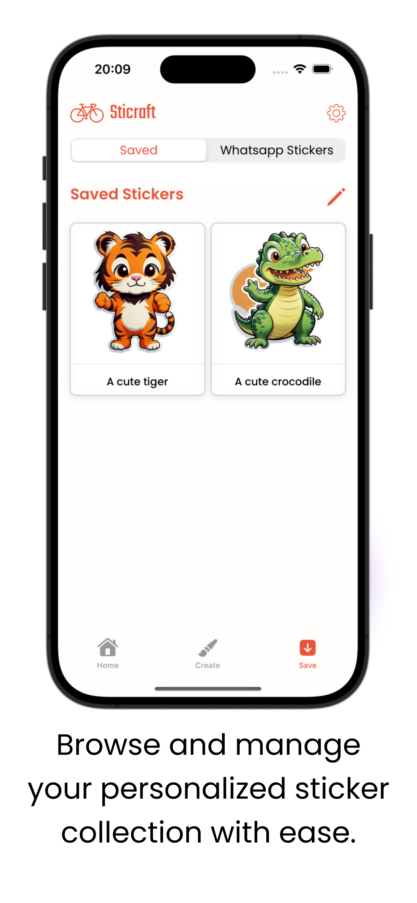

# Sticraft

    
    

Welcome to **Sticraft**, your creative AI-powered sticker maker!  
Whether you're looking to personalize your messages or create unique visuals, Sticraft lets you generate high-quality stickers in seconds — right from your phone.  
**Download now from the App Store and start crafting!**

---

## 🎨 What is Sticraft?

**Sticraft** is a user-friendly mobile app that uses advanced AI to generate unique, custom stickers from your prompts or ideas.  
Simply enter a concept, choose a style, and let Sticraft turn your imagination into fun, shareable stickers.  
Perfect for social media, messaging apps, or just expressing yourself in a creative way!

---

## 🔑 Key Features

- **AI-Powered Sticker Generation**  
  Turn your ideas into stickers instantly with cutting-edge AI models.

- **Creative Prompt System**  
  Describe what you want — Sticraft handles the rest.

- **Custom Styles & Categories**  
  Choose from various styles like cute, realistic, pixel-art, minimal, and more.

- **High-Quality Output**  
  Download crisp, transparent PNG stickers ready to share.

- **Fast & Fun Interface**  
  Designed for speed and simplicity — create in seconds, share in one tap.

---

## 📥 Download Now

Ready to bring your ideas to life as stickers?  
Download **Sticraft** now and explore the power of AI creativity at your fingertips!

👉 [**Download on the App Store**](https://apps.apple.com/tr/app/sticraft-ai-stickers-whatsapp/id6581489483)
